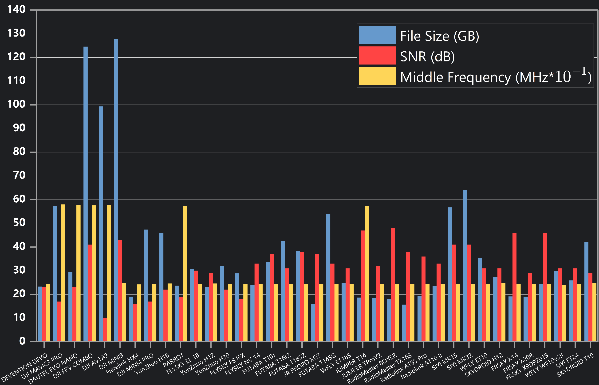

# The RFUAV DATASET
## Abstract
The official repository of our paper: ”RFUAV: A Benchmark Dataset for Unmanned Aerial Vehicle Detection and Identification“. RFUAV provides a comprehensive benchmark dataset include raw frequency signal data and spectromgrams for drone detection and indentification tasks.  
The raw data in dataset include 35 of different types of drone under high signal-to-noise ratio (SNR). This dataset is available to all researchers who use RF to analyze drones. You can analyze the data through Deep Learning methods we provided or any traditional signal processing methods like Decode, Demodulation, and FFT. The detailed information of the dataset is shown in the following figure.
  
We analyzed property of each drone in the dataset include: Frequency Hopping signal bandwidth (FHSBW), Frequency Hopping Signal Duration time (FHSDT), Video Transmitted Signal Bandwidth (VSBW), Frequency Hopping Signal Duty Cycle (FHSDC), and Frequency Hopping Signal pattern period (FHSPP). And plotted their distribution as shown below. More detailed information is presented in our paper.
  
with the dataset you can achieve:
  <video width="600" controls>
    <source src="./abstract/output_video.mp4" type="video/mp4">
    Your browser does not support the video tag.
  </video>

## 1.Quick start

installtion

    pip install -r requirements.txt

inference with utils.benchmark 

    python inference.py

quick train using resnet50 on a small dataset 

    python train.py

## 2.Usage

### 2.1 How to transform the raw frequency signal data into the spectromgram format
We provide a signal processing pipeline for transmitting the binary raw frequency signal data into the spectromgram format using the both MATLAB toolbox and Python. 

You can simply use the provided code to check the spectromgram of a specialized data pack. Notice that the arg 'oneside' controls whether to show the half-plane or the full-plane spectromgram.

    datapack = 'Your datapack path'
    test = RawDataProcessor()
    test.ShowSpectrogram(data_path=datapack,
                         drone_name='DJ FPV COMBO',
                         sample_rate=100e6,
                         stft_point=2048,
                         duration_time=0.1,
                         oneside=False,
                         Middle_Frequency=2400e6
                         )
You can use the following code to transform the raw frequency signal data into spectromgrams as a .png image automatically.

    data_path = 'Your datapack path'
    save_path = 'Your save path'
    simple_rate = 100e6
    test = RawDataProcessor()
    test.DrawandSave(fig_save_path=save_path, file_path=data_path, fs=sample_rate,
                    stft_point=1024, duration_time=0.1)

You can also use the following code to save the spectromgram as a video. video can help you to better observe....

    save_path = 'E:/Drone_dataset/RFUAV/darw_test/'
    save_as_video(datapack=datapack,
                  save_path=save_path,
                  fs=100e6,
                  stft_point=1024,
                  duration_time=0.1,
                  fps=5,
                  )
You can also use the following code to transform the rawdata into a spectromgram waterfull video. video can help you to better observe....

    save_path = 'E:/Drone_dataset/RFUAV/darw_test/'
    waterfull_video(datapack=datapack,
                  save_path=save_path,
                  fs=100e6,
                  stft_point=1024,
                  duration_time=0.1,
                  fps=5,
                  )

### 2.2 How to estimate the signal to noise ratio
We provide a SNR estimation method for you to better analysis the binary raw frequency signal data Using the MATLAB toolbox. and we also provide the SNR adjustment method to noisy the raw frequency signal data and adjust it into the different SNR levels.

    print("Hello World")

### 2.3 How to train and inference the detection
We provide the training code for the signal detection and drone identification tasks based on the PyTorch framework. The currently supported models include ViT[link], ResNet[link], MobileNet[link], EfficientNet[link], and Swin Transformer[link]. You can also customize your own model by using code in utils.model.base.

For customized the training, you can create/modified a configration file ended with '.yaml', And specify the configration file path in training code. You can also modify the args in utils.trainer.CustomTrainer() to achieve the desired training.

        CustomTrainer(
            model='resnet50',
            train_data_path='Your train data path',
            val_data_path='Your val data path',
            num_classes=23,
            save_path='Your save path',
            weights_path='Your weights path',
            device='cuda:0',
            batch_size=32,
            shuffle=True,
            image_size=224,
            lr=0.0001,
        ).train()

We provide the pipeline for the inference, you can inference your model on spectromgram or binary raw frequency data using the following code. The inference on the binary raw frequency data will automatically packed into a video with the identification result on the spectromgram. Notice, if you want to infernce the binary raw frequency data, you should specify a weight trained by the spectromgram dataset provided by python pipeline.

    test = Model(cfg='Your configration file path',
                 weight_path='Your weights path')

    test.inference(source='Your target data path',
                   save_path='Your target save path')

### 2.4 Evaluate your model on the benchmark 

You can evaluate your model on benchmark, and using mAP, Top-K Acc, F1, Confusion Matrix to evaluate your model. Your model will be evaluated on the -20dB-20dB data set separately, and finally a model performance at different signal-to-noise ratios will be obtained.

    test = Model(cfg='Your configration file path',
                 weight_path='Your weights path')

    test.benchmark() ####

### 2.5 Some useful tools to help you to process the dataset
Based on our experimental results, we provide a ready-made image dataset, but you can also directly obtain our raw data for processing as you wish. We provide a Matlab (tool.Sep_sec.m) program tool for segmenting raw data. You can specify any packet of raw data to be segmented every 2S. The segmented data packets are smaller and easier to process.

At the same time, the benchmark we use contains drone image data with different signal-to-noise ratios, but the training set we provide only contains drone image data in its original state. Directly using this training set may cause the model to perform poorly on the benchmark. Therefore, we provide a data enhancement tool (utils.preprocessor.data_augmentation) to improve the accuracy of the model.
        
    data_path = "Your dataset path"
    output_path = "Your output path"
    method = ['Aug1', 'Aug2', ...]
    
    data_augmentation(dataset_path=data_path,
                      output_path=output_path,
                      methods=method)

## 3.Notice 
### 3.1 Raw data parameter description

### 3.2 Dataset file Structure
Your dataset file structure should be organized as follows, if you are using the provided dataloader.  
Dataset  
├── train  
│ ├── AVATA  
│ │ └── imgs  
│ └── MINI4  
│ &nbsp;&nbsp;&nbsp;&nbsp;└── imgs  
├── valid  
&nbsp;&nbsp;&nbsp;├── AVATA  
&nbsp;&nbsp;&nbsp;│ └── imgs  
&nbsp;&nbsp;&nbsp;└── MINI4  
&nbsp;&nbsp;&nbsp;&nbsp;&nbsp;&nbsp;&nbsp;└── imgs  
## 4.Dataset download

## 5.Experiment results

## Citation
